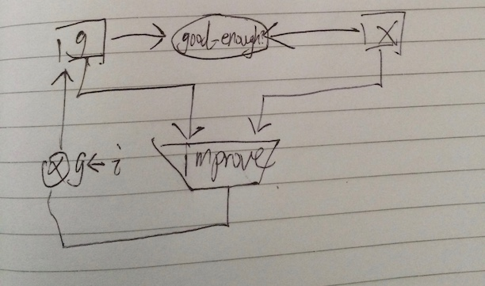

```scheme
;Exercise 5.3: Design a machine to compute square roots using Newton’s method, as described in 1.1.7:
;
(define (sqrt x)
  (define (good-enough? guess)
    (< (abs (- (square guess) x)) 0.001))
  (define (improve guess)
    (average guess (/ x guess)))
  (define (sqrt-iter guess)
    (if (good-enough? guess)
        guess
        (sqrt-iter (improve guess))))
  (sqrt-iter 1.0))
;Begin by assuming that good-enough? and improve operations are available as primitives. Then show how to expand these in terms of arithmetic operations. Describe each version of the sqrt machine design by drawing a data-path diagram and writing a controller definition in the register-machine language.(load "/Users/soulomoon/git/SICP/Chapter5/ch5-regsim.scm")
(define factorial-machine
(make-machine
  '(c p n)
  (list (list '+ +) (list '* *) (list '> >))
  '(
    (assign c (const 1))
    (assign p (const 1))
  test->
    (test (op >) (reg c) (reg n))
    (branch (label factorial-done))
    (assign p (op *) (reg c) (reg p))
    (assign c (op +) (reg c) (const 1))
    (goto (label test->))
  factorial-done
)))

(define factorial-machine1
(make-machine
  '(c p r t n)
  (list (list '+ +) (list '* *) (list '> >))
  '(
    (assign c (const 1))
    (assign p (const 1))
  test-c
    (test (op >) (reg c) (reg n))
    (branch (label f-done))
    (assign r (op *) (reg c) (reg p))
    (assign p r)
    (assign t (op +) (reg c) (const 1))
    (assign c t)
    (goto (label test-c))
  f-done
)))

(set-register-contents! factorial-machine 'n 5)
(start factorial-machine)
(get-register-contents factorial-machine 'p)

(set-register-contents! factorial-machine1 'n 5)
(start factorial-machine1)
(get-register-contents factorial-machine1 'p)
```
data-path:  
  
controller:  
  
